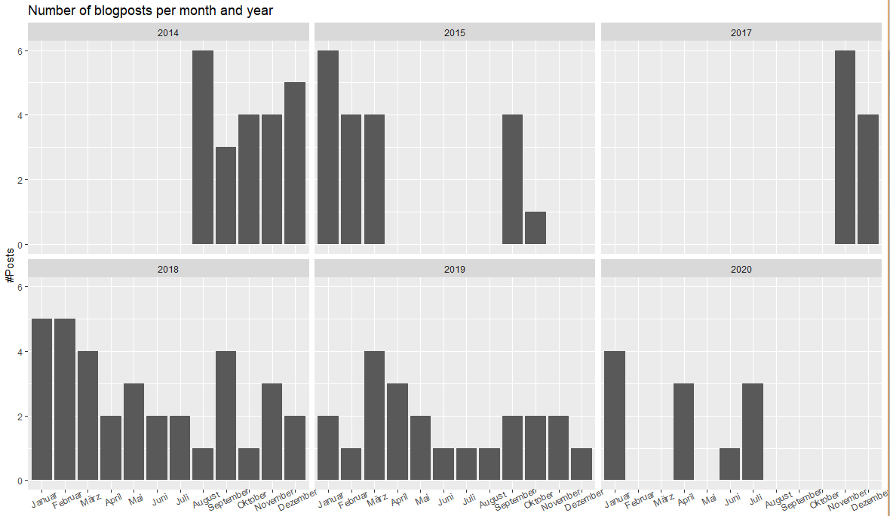
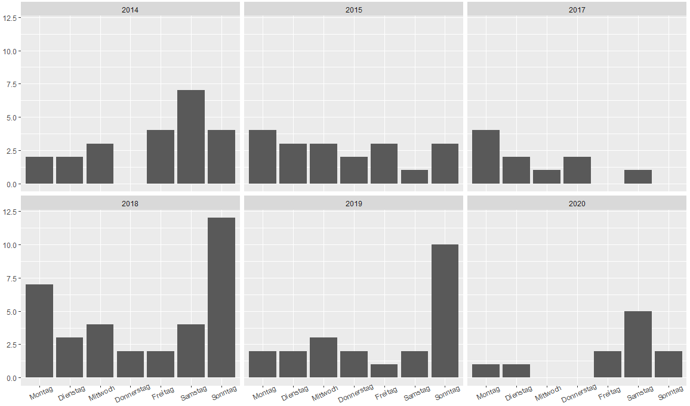
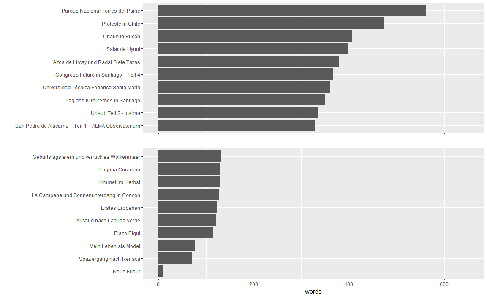
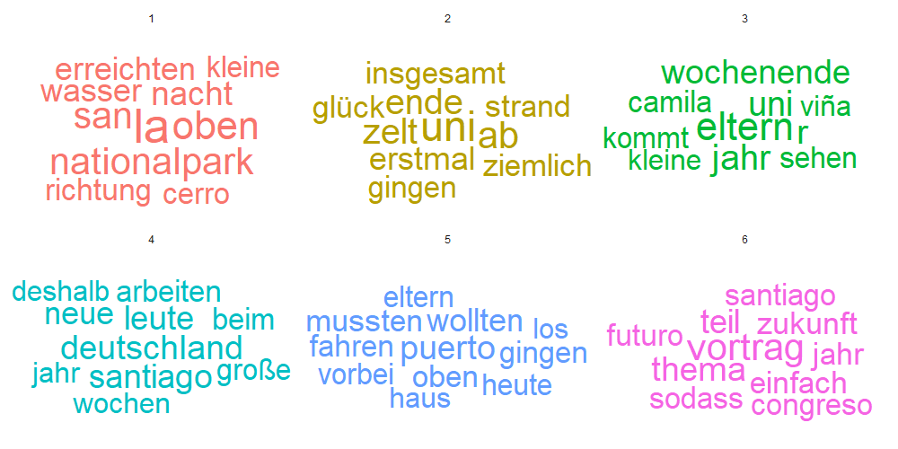

# Analyze-my-own-travel-blog

Since I came to Chile for the first time in 2014 I am writing a blog for family and friends to write about my experiences. It can be visited [here](richard-in-valparaiso.blogspot.com).

I wrote a script to scrape all texts and dates from the blog to do some analysis.

First, I just looked at when I wrote my articles.

It is also interesting to see at which weekdays I wrote most articles. There are differences between my time at the university (2014-15) and my working life (2017 onwards).

Then I started analyzing the texts and looked at the longest and shortest articles.

And finally I did topic modelling with LDA and created a wordcloud with the most characteristic words of each topics.

